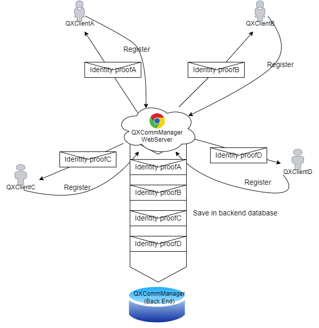
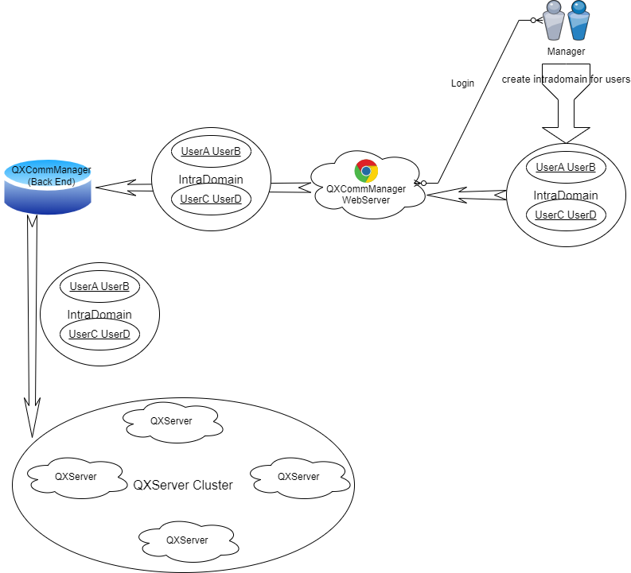
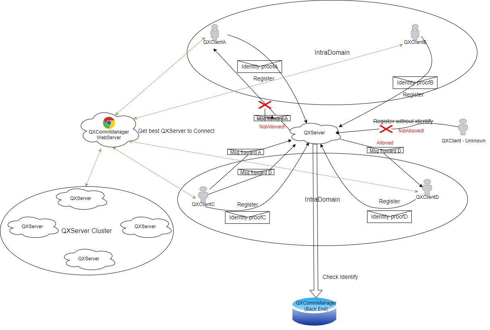
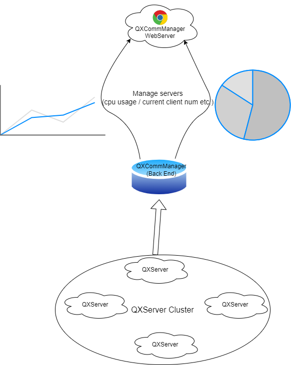

# QinXComm
Secure communication and remote management

## 项目架构及功能说明

### 架构说明

QXComm包含以下模块： QXCommMngr、QXServer、QXClient和一些可以单独部署的小组件（redis/mongo）

#### 1. QXCommMngr

QXCommMngr一般暴露在公网（或部署在局域网），提供以下服务：

1. 提供api接口，为QXClient提供当前负载最小的QXServer地址（可使用安全服务，为数据使用对应Client公钥加密传输）
2. 管理QXServer，包括：查看QXServer当前机器健康状态、查看当前QXServer当前注册在线的所有Client、使能/关闭QXServer对Client提供服务、为QXServer提供身份认证服务
3. 出于安全性考虑，QXServer/QXClient的密钥对生成由自身负责，不由QXCommMngr生成。QXCommMngr只能保存/验证parnter/user的身份信息，不能涉入QXServer/QXClient的安全性
4. 为QXClient、QXServer提供注册服务，并导入公钥，生成id，将id-公钥作为唯一身份信息（写入mongo）
5. 为QXClient提供互通域管理服务，只有在互通域之中的QXClient才能相互传递消息（写入mongo）
6. 前后端通过api的方式交互，以前后端分离的形式部署。可将后端部署在私网，可使用nginx反向代理部署后端集群

#### 2. QXServer

QXServer可选暴露在公网或部署在局域网，提供以下服务：

1. 在注册之前，自动生成公私钥
2. 可以创建集群，多个QXServer作为负载均衡；或创建私有QXServer只为指定QXClient提供连接
3. 从QXCommMngr自动同步互通域，明确哪些QXClient可以相互转发消息
4. 对外暴露接口，提供给QXClient提供连接，且只接受在QXCommMngr上注册过的QXClient的注册
5. 对初次链接的QXClient进行双向挑战应答，进行身份识别和会话密钥协商
6. 为互通域内的QXClient转发消息，拒绝非互通域内的消息转发，转发过程可选protobug明文/SM4加密传输
7. 向QXCommMngr提供所在机器的健康情况，以及QXServer的工作情况（写入redis）

#### 3. QXClient

QXClient出于安全考虑，一般部署在局域网，提供以下服务：

1. 在注册之前，自动生成公私钥
2. 通过数字信封的形式，对QXCommMngr请求QXServer地址进行连接
3. 与QXServer双向挑战应答，进行身份认证和会话密钥协商
4. 注册后，并且添加互通域后，可以向指定QXClient发送消息
5. 对QXServer集群可以自动切换，在当前的QXServer连接出问题时，自动切换集群中其他备机

#### 4. 数据库服务

数据库出于安全考虑，部署在私网，提供服务：

1. mongo保存QXClient的公钥消息、互通域信息，在QXServer启动时，读取互通域消息
2. redis保存QXServer的相关健康信息

### 功能说明

#### 1. QXCommMngr权限控制

* 角色：manager

  仅manager可以注册互通域、获取QXServer管理信息

* 角色：partner

  partner（QXServer）可以在注册界面进行QXServer的注册

* 角色：user

  user（QXClient）可以访问注册界面进行QXClient的注册

#### 2. QXServer注册

partner在QXCommMngr上登录后，可以注册QXServer，在后台机器上生成密钥对后，导出公钥注册到QXCommMngr，作为身份证明

#### 3. QXClient注册

QXClient在QXCommMngr上注册，在后台机器上生成密钥对后，导出公钥注册到QXCommMngr，公钥将在QXCommMngr的数据库留存



#### 4. 互通域管理

manager角色可在前端界面设置互通域，指定某些Client可以相互通信。设置后，互通域保存在mongo数据库中，并且通知所有QXServer同步互通域，通过版本号管理。



#### 5. QXClient消息交互

QXClient先通过QXCommMngr api，获取当前最佳的QXServer地址进行连接，并通过ssl/tls协议进行身份验证和信息加密。 连接后，同样通过公私钥对，在QXServer上进行注册。 注册完成后即可对互通域内的所有QXClient进行通信。



#### 6. QXServer监控以及远程控制、负载均衡

QXServer在启动后，定期向redis中写入监控数据例如cpu、内存使用情况，负载情况，由QXCommMngr进行远程管理，通过enable/disable来开启/关闭server转发服务。



### 安全性说明

考虑到现在国家正在大力推进GmSSL，所以本项目除了SSL/TLS的安全服务都使用GmSSL算法库而非OpenSSL

#### 1. QXCommMngr、QXServer之间的安全性

* QXCommMngr如何验证QXServer的合法性？

  * 在QXserver通过合法注册的partner注册后，QXServer应当生成SM2密钥对

  * QXCommMngr留存公钥，以作为该id的身份标识
  * 在QXServer连接上QXCommMngr、建立SSL连接之后，要求其对发出的Enc(随机数，PubKey)进行解密，并且将解密出的随机数附上签名返回给QXCommMngr，若随机数一致以及验签成功，才会继续其他业务的处理

* QXServer如何验证QXCommMngr的合法性？

  * partner注册后，可以通过在QXServer预置QXCommMngr SSL/TLS证书，在建立SSL连接时指定该证书，以验证QXCommMngr

* 消息交互过程：

  * 使用SSL信源加密，保证安全性

  综上，QXCommMngr、QXServer之间的安全性，使用SM2算法、SSL/TLS协议提供身份认证、授权、加密服务，保证数据完整性、非否认性。

#### 2. QXCommMngr、QXClient之间的安全性

* QXClient如何验证QXCommMngr的合法性？

  * QXClient使用https服务，保证QXCommMngr的合法性

* QXCommMngr如何验证QXClient的合法性？

  * QXClient发起https请求时，必须附带id及对当前时间戳的SM2私钥加密

* 消息交互过程：

  * 仅一次交互，通过SM2算法保证安全性

  综上，QXCommMngr、QXClient之间的安全性，使用SM2算法、SSL/TLS协议提供身份认证、授权、加密服务，并且通过时间戳来防止重放攻击

#### 3. QXServer、QXClient之间的安全性

* QXClient、QXServer如何验证双方的合法性

  * 前置条件：QXServer在QXCommMngr注册后，会获取当前所有的QXClient的id和公钥（可以增量更新，防止每次数据量过大）。QXClient则是启动后，可以通过向QXCommMngr发起请求，获取当前QXServer的最佳可用地址及其公钥。
* 注册过程：QXClient先发起注册请求，QXServer收到后，发出时间戳和随机数，通过QXClient公钥加密，QXClient解密后，将此二者返回，并且也生成自己的时间戳和随机数，使用QXServer公钥加密，发送给QXServer，要求其解密后返回。此过程验证完成后，QXCient、QXServer正式注册，再进行相关业务处理。
  * 消息转发过程：可选SM4预置密钥/协商密钥进行消息信源加密，保证转发过程中的安全性。
* 而在QXClient-QXClient之间，则属于信源+信道加密

### 性能说明

* QXServer和QXClient、QXCommMngr和QXServer之间的通信使用protobuf编码，可以有效降低网络传输数据大小。
* QXServer和QXClient之间的加密传输通过SM4加密，性能略逊于AES，优于3DES，但内存需求通常低于此二者，可以更好地在低端设备上运行。若引入支持SM4的硬件提供加密服务/快速软件实现技术，加密性能将更上一筹。

## 构建流程

本仓库使用cmake构建，适配类unix系统，windows系统正在计划适配QXClient，若有某些系统不适配请联系作者。

版本信息：

cmake version 3.22.1 

gcc version 11.4.0 (Ubuntu 11.4.0-1ubuntu1~22.04) 

java version "17.0.6" 2023-01-17 LTS

Apache Maven 3.6.3

@vue/cli 5.0.8

### 1. 克隆代码仓

git clone --recursive  https://github.com/QinX132/QXComm.git (--recursive 克隆所有子模块的代码仓)

### 2. 构建

```sh
cd QXComm

./build -a
```

### 3. （选读）单独模块构建

#### Ⅰ 三方仓构建

在工程目录执行./build -t ，将会自动进入third_party，执行third_party_build_all.sh脚本，构建gmssl()、libevent库（优先构建静态库）

三方库依赖以及其版本：

> [submodule "third_party/GmSSL"]
>
> ​	path = third_party/GmSSL
>
> ​	url = https://github.com/guanzhi/GmSSL.git (commit:6de0e022)
>
> [submodule "third_party/json"]
>
> ​	path = third_party/json
>
> ​	url = https://github.com/nlohmann/json.git (commit:199dea11)
>
> [submodule "third_party/libevent"]
>
> ​	path = third_party/libevent
>
> ​	url = https://github.com/libevent/libevent.git (commit:d655c06b3a6b0fe8cff900f293bf0e5aac6eb0a2 v3.1.1)


#### Ⅱ 部署protobuf
1. 下载protobuf并部署：

   ```sh
   wget https://github.com/protocolbuffers/protobuf/releases/download/v21.12/protobuf-all-21.12.zip
   unzip protobuf-all-21.12.zip
   cd protobuf-all-21.12
   ./configure
   make
   sudo make install
   sudo ldconfig                                      # refresh shared library cache.
   ```

#### Ⅲ 构建utils代码仓：

在工程目录执行./build -u ，将会自动进入utils，执行 utils_build.sh脚本，编译所有.c文件，并且将此代码仓的文件编译为.a文件。此代码仓包含了一些c语言编写的模块功能，包括安全管理模块、健康检查模块、日志模块、内存管理模块、命令行模块、线程池模块、定时器模块、网络消息模块、作者自己编写的双向循环链表，以及一些常用的api。（相关的模块说明待开发者补充）

该目录内置unittest，如果要执行单元测试，执行如下操作：

```sh
sudo apt-get install libcurl4-openssl-dev // 下载curl 4 openssl

cd utils

rm build -rf && mkdir build && pushd build

cmake -DBUILD_SHARED_LIBS=OFF -DBUILD_TESTS=ON ..

make && make test
```

#### Ⅳ 构建QXServer 、 QXClient 代码共享仓（主要是protobuf文件）

在工程目录执行./build -h ，将会自动进入SCShare，执行 scshare_build.sh脚本，编译.proto文件，并且将此代码仓的文件编译为.a文件

#### Ⅴ 构建 QXServer、QXClient 服务

在工程目录执行./build -sc ，将会自动进入QXServer、QXClient，执行脚本，编译。生成可执行文件QXServer/src/build/QXServer、 QXClient/src/build/QXClient。

# RoadMap

### QXCommMngr 前端

* 提供不同权限账号注册界面 ×
* 提供对应权限账号注册不同角色的界面×
* 为partner提供证书导出界面按钮×
* 为partner、user提供密钥生成界面按钮×
* 为manager提供QXServer监控界面×
* 为parnter提供QXServer互通域管理增删改查界面×
* 提供SM2公钥导入界面×

### QXCommMngr 后端

* 为QXServer提供SSL QXCommMngr Server服务 √
* api接口框架搭建√
* 为api提供权限控制×
* 为QXClient提供QXServer信息请求接口（openapi）×
* 添加互通域增删改查api×
* 提供SM2公钥导入api×

### util 组件

util组件是作者用c语言开发的使用工具仓，旨在为上层应用提供便捷的接口。目前仅适配类unix系统

* msg模块，提供tcp server/client消息交互接口
  * 提供带前后缀的消息接口，包含较为详细的信息包括sessionid、type、vermagic、clientid等，支持在消息末尾添加签名 √
  * 提供快速传输的消息接口，消息头仅包含ContentLen，其他服务由上层调用在Content中自行实现√
  * 提供消息分片功能 ×
  * 对health模块提供健康管理接口 √
* mem模块，提供内存管理接口 √
  * 对外提供默认内存申请/释放接口√
  * 对外提供注册接口，对单独的申请者提供内存管理服务√
  * 提供内存泄漏检查接口√
  * 对health模块提供健康管理接口 √
* cmdline模块，提供守护进程前台管理接口 √
  * 为上层提供注册自定义管理类型的接口(QXUtil_CmdExternalRegister) √
  * 对health模块提供健康管理接口 √
* log模块，提供日志接口 √
  * 为上层提供适配cpp的打印类名的接口√
  * 提供日志文件自动切割功能√
  * 解决运行过程中日志文件被删除的问题√
  * 对health模块提供健康管理接口 √
* health模块，提供健康管理接口
  * 对外提供自定义的健康管理接口 √
* timer模块，提供定时任务接口
  * 将timer handle所有权转交外部√
  * 支持添加一次性和循环任务√
* threadpool模块，提供线程池接口
  * 对外提供定制化参数配置接口√
  * 对外提供实时修改参数配置接口√
  * 将threadpool实例所有权转交外部×
  * 对health模块提供健康管理接口 √
* crypt模块，提供安全服务接口 
  * 提供gmssl 密码学安全的随机数生成接口√
  * 提供gmssl sm2密钥生成/导入/导出接口√
  * 提供gmssl sm2签名/验签接口√
  * 提供gmssl sm2加密/解密接口√
  * 提供gmssl sm3 hash生成接口√
  * 提供gmssl sm3 hmac生成接口×
  * 提供gmssl sm4 ecb算法加密/解密接口×
  * 提供gmssl sm3 cbc算法加密/解密接口√
* 为每一个模块提供单元测试UnitTest，覆盖基本功能验证√
* 对外提供个性化初始化接口，包括自定义参数以及自定义模块√
* 为java提供utiljni服务 ×

### QXServer

* 提供QXClient连接接口√
* 完善QXClient注册机制√
* 提供单进程多线程实例机制√
* 与QXCommMngr Server进行SSL通讯√
* 提供QXCommMngrServer自动重连逻辑√
* 定期向QXCommMngr上报监控数据√
* 定期flush长期未注册成功的QXClient×
* 完善QXCommMngr注册机制（50%）√
* 与QXClient之间引入SM4加解密√

### QXClient

* 提供QXServer自动重连逻辑√
* 增加QXServer断连自动重试状态机√
* 完善QXServer注册逻辑（50%）√
* 增加QXServer注册失败自动重试状态机√
* 引入SM4加解密√
* 从QXCommMngr获取QXServer相关信息×
* 为主流客户端提供图形化界面（via Qt）×
